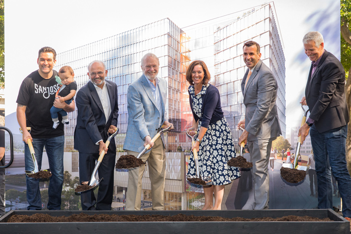
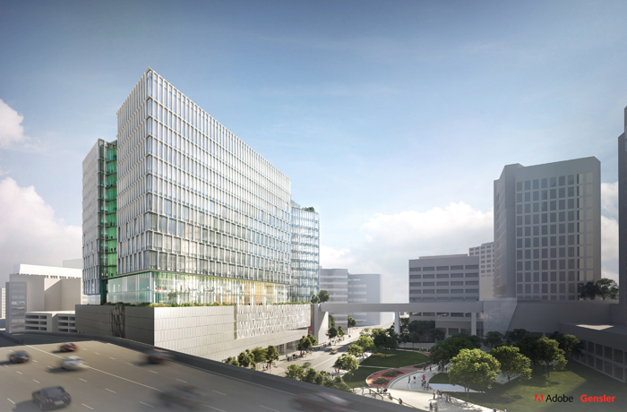
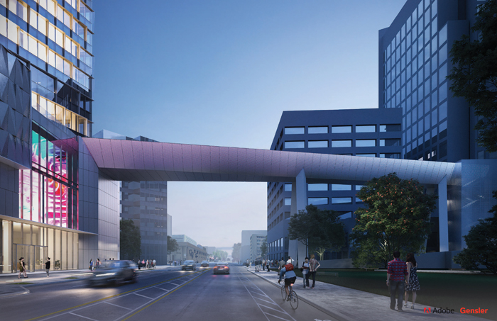

# Adobe Breaks Ground on North Tower in San Jose

### Investing in our employees and community as we expand our headquarters

Adobe Breaks Ground on North Tower in San Jose

Today we held a groundbreaking ceremony for the Adobe North Tower—the fourth tower at our global headquarters in downtown San Jose. We’re excited to expand our presence and our commitment to San Jose, adding capacity for approximately 4,000 incremental employees and growing our corporate campus. Adobe is tremendously proud to have called San Jose home for the last 25 years. It’s a city that is the heart of Silicon Valley and a location that allows us to attract some of the best talent in the industry.

Today our investment in San Jose continues, through our growth and a commitment to sustainability. We’re excited to announce that our North Tower will be an all-electric building that can be powered by clean, renewable energy, and will be among the first of its kind in Silicon Valley.

## From Past to Present

We’ve come a long way since our founders John Warnock, and Chuck Geschke first started the company in Los Altos in 1982. It was John and Chuck’s vision and passion that “put Adobe on the map” in the business world, and they later made the decision to put Adobe on the map in San Jose in 1994 when they recognized the unique opportunity to break ground on a headquarters, becoming the first major technology company to invest in downtown real estate.

Today, we are a Fortune 500 company with more than 21,000 employees in offices around the globe, and technology that has changed the face of business, creativity, and culture. Over the past few years, we’ve grown our sites in the U.S. and around the world, but it is our corporate location that has roots with the founding of Adobe.

C.Fiorito/Compass Photographers

## About the North Tower

Today we’re sharing new renderings of the North Tower—a building that will change the San Jose skyline. The North Tower will be connected to our existing campus by a pedestrian bridge extending over San Fernando Street. This bridge will be the first of its kind in downtown San Jose and will play an integral part in keeping our employees connected as we grow. We’ll also be including retail space in the North Tower.

## Commitment to the Community

Investing in San Jose means more than just expanding our site. We are committed to creating positive change in the communities where our employees work and live. We are proud to work with over 260 local San Jose nonprofits, including Downtown Streets Team, City Year, Second Harvest Food Bank, Sacred Heart Community Service, The Family Giving Tree, and more, to provide volunteer hours, pro bono services, board service, grants and matching donations.

Operating our business sustainably is another way we aim to make a positive impact. The all-electric North Tower will help us reduce our greenhouse gas emissions and demonstrates our commitment to power our operations with 100 percent renewable energy by 2035, which will reduce our environmental footprint. While most buildings rely on natural gas, a fossil fuel, to power heating and cooling, running fully on electricity means that our power can be generated from renewable sources like wind or solar energy. In addition to reducing energy consumption and investing in new technology that can help us achieve our goals, we are also advocating for policies to open up direct access to renewable energy in California and beyond, so that not just our business, but the community as a whole can benefit. It’s vital that we do our part to help mitigate climate change, and the North Tower will bring us one step closer to doing just that.

## Looking to the Future

As Adobe continues to grow, we are dedicated to creating and enhancing workplaces that further innovation, collaboration, community, sustainability, and to be THE leading company for exceptional employee experiences. Expanding our facilities will help us attract the best and brightest talent, and better serve our customers.

Our headquarters expansion marks a new chapter for Adobe, and we are thrilled to start it right here in San Jose. We plan to complete the North Tower in 2022, and we’ve set up a [construction time-lapse camera](https://app.oxblue.com/open/ADOBE/NORTHTOWER) to share the progress we’re making.

---

by Donna Morris, Chief Human Resources Officer & Executive Vice President, Employee Experience  
posted on 06-24-2019

---

Topics: Adobe Leaders, News, Work

---

Products:
