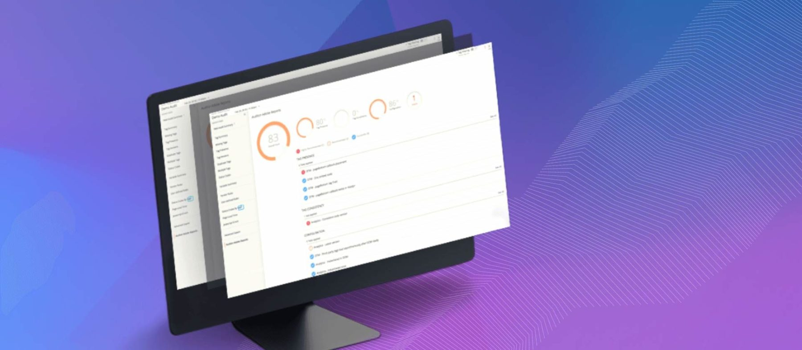
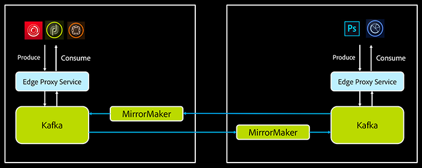
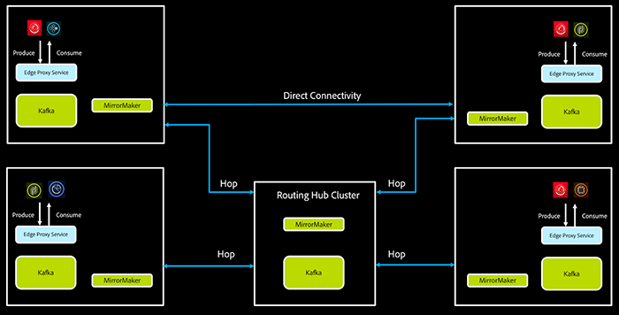

# Creating Adobe Experience Platform Pipeline with Kafka

### How we deployed a single enterprise-level message bus (“Pipeline”) using Kafka for Adobe Experience Platform.

Creating Adobe Experience Platform Pipeline with Kafka

Over the last decade, the expectations for data processing at scale have changed dramatically. Data collection and processing have moved from being a largely batch-oriented affair to requiring fully streaming methodologies. This change has been driven by the needs of companies to work on high-velocity data and respond to changes in customer behavior and demand in seconds, not days and hours.

The aggregation, enrichment, and near-real-time analysis of high-frequency data present a whole new set of challenges. Particularly when the goal is to take data collected at any experience point, derive insights, and then deliver the next best experience at the speed customers demand, tying multiple messaging systems together is a non-starter. To power the Adobe Experience Platform we have created a single data processing**Pipeline** that allows our internal service developers to quickly and easily ship data from any publisher in any data center to any consumer in any data center around the world. On top of that, we provide capabilities for developers to easily do streaming computation to analyze, join, transform, and enrich those data sets while they are in motion.

## What is Adobe Experience Platform Pipeline?

Based on Apache Kafka, Adobe’s Experience Cloud Pipeline is a globally distributed, mission-critical messaging bus for asynchronous communication across Adobe solutions. Pipeline processes tens of billions of messages each day and replicates them across 13 different data centers in AWS, Azure, and Adobe-owned data centers. In terms of volume and throughput, it is the largest deployment of Kafka at Adobe today.

As such, it encompasses:

-   A standard, highly scalable, low-latency messaging system built on [Apache Kafka](http://kafka.apache.org/)
-   Routing capabilities so that service A can send messages to service B without having to know what data center(s) B resides in
-   External-facing HTTPS endpoints for publishing messages to Pipeline from edge data centers
-   Filtering messages on the server side so clients read only what they are interested in

## Our challenge

Adobe Experience Platform handles petabytes of events per month. The constituent services operate across 17 different data centers around the globe. Consequently, Pipeline is used to shuffle a significant number of these events across various services. These events include website and [mobile](https://magento.com/products/magento-commerce "mobile") beacons, push notifications, campaign life cycle events, Adobe Creative Cloud storage quota updates — critical data that keeps our business and our customers’ businesses running smoothly. To put things in context, on a good day Pipeline handles anywhere between **10-15 billion events**, and we’re gearing up to support well over 100 billion daily by the end of 2019.

So, at a high level, we needed a technology that checks the following boxes:

-   Super easy to scale linearly
-   Relatively simple, asynchronous pub-sub semantics
-   Fault tolerance under extreme pressure
-   Support for processing of events as they’re seen (near real time)
-   Guaranteed at-least-once processing of events

Given these requirements, Apache Kafka was the obvious choice of our messaging substrate since it fit more than 80% of the use cases that we needed to support at scale. (For the remainder, we chose between RabbitMQ or ZeroMQ for our high-volume messaging needs that did not need to guarantee the durability of messaging.) We chose Kafka because it is robust, fault tolerant, and heavily supported in the [open source](https://magento.com/products/magento-open-source "open source") community, with a vibrant ecosystem of applications and frameworks to support our evolving needs.

Additionally, we developed two components to meet our specific business needs: Smart Edge Service and Pipeline Console.

## Smart edge service

Adhering to Adobe Experience Platform’s open and extensible architecture, we needed Pipeline services exposed as REST endpoints. There was an additional motivator that the Pipeline service is available in a subset of data centers Adobe operates in. When we started building Pipeline back in 2014, there were no REST proxy services available in the community that fit our requirements so we built a custom service to:

1.  Expose Produce and Consume APIs as REST endpoints
2.  Route the message anywhere in our global infrastructure based on rules specified in the message or in the topic metadata
3.  Filter messages on the server side so that only relevant messages reach the consumers
4.  Provide authorized access the services to produce and consume messages
5.  Allow ACLs on the topic to restrict produce and consume access to whitelisted services
6.  Provide a registry of a standardized schema that defines a common language of message exchange

As it turns out, meeting these requirements for billions of messages a day in a faulty environment is a complex problem. You have to think about different kinds of failures, buffering semantics, retry behavior. Consequently, we spend a lot of time optimizing this layer.

Adobe Experience Platform data connectivity architecture.

We’ve recently started extending our Smart Edge capabilities to support real-time stream processing for quick delivery of actions. Again, building on the Kafka ecosystem, we chose to go with Kafka Streams as the underlying technology.

One of the biggest features of the Smart Edge service is its ability to route messages across data centers globally. Routing could be defined as delivering a message to one or more destination clusters, without the producer or the consumer knowing where to send the message or where it came from. Smart Edge allows specifying routing rules at the topic level, or routing can be inferred from the metadata embedded in the message header.

We achieve routing by producing messages to appropriate topics that are mirrored across data centers. We use MirrorMaker to achieve this. As we add more data centers, the number of MirrorMaker clusters required for complete graph connectivity (in other words, every data center connecting directly with every other data center) grows exponentially. This, while neat, is not a scalable solution. Many companies that operate Kafka clusters at a large scale face this issue. One way of solving the problem is to introduce a “hop cluster” to route messages and reduce the number of directly connected data center nodes. Other options are using a different mirroring solution than MirrorMaker, such as Confluent Replicator.

Adobe Experience Platform Pipeline intelligent routing.

# **Pipeline Console**

With more than 100 teams at Adobe depending on Pipeline for their day-to-day business, we very quickly hit a wall in terms of human scalability. For a service like Pipeline, reducing technical debt is just as important as innovation. So, to help the team get cycles back, we decided to build out a console that allows our clients to take care of the basic upkeep of their topics, monitoring, and simple diagnosis themselves. Additionally, it provides a surface area for our clients to configure custom routing rules, managing access control at a granular level.

Pipeline Console provides a view to manage not just Kafka-related properties but also Adobe-specific intelligence we’ve baked into Pipeline:

-   Distinct user roles for federated management and CRUD on topics
-   Topic search and discovery through meta-data
-   In-context monitoring of topic and publisher/consumer health
-   Granular access control at the HTTP layer for who can read or write to a given topic
-   Routing topology management (local to routed or broadcast, add flexible router, and so on)
-   Topic tailing for seeing the last message or next (n) messages

There is an aspect of Console that overlaps with capabilities provided by Confluent through the Control Center, and we intend to use both for different purposes.

If you want to try access and try out the APIs that are using Experience Platform Pipeline, here is our API [documentation](https://www.adobe.io/apis/cloudplatform/dataservices/data-ingestion/data-ingestion-services.html#!api-specification/markdown/narrative/technical_overview/streaming_ingest/getting_started_with_platform_streaming_ingestion.md).

# **What we learned at Kafka Summit**

Mirroring data to data centers globally using MirrorMaker remains a challenge. There are many efforts in the industry working on solving the problems. We are excited to see those developments. Another major push is to run Kafka on Kubernetes to accommodate elastic use cases in stream computing. Our goal is to be able to spin up on-demand Kafka clusters to cater to growing needs. Being able to run Kafka on Kubernetes will accelerate us toward that goal.

There was a lot of focus on real-time stream processing technology, which was very advantageous as it aligns well with our initiatives.

_Follow the_[_Adobe Tech Blog_](http://medium.com/adobetech)_for more developer stories and resources, and check out_[_Adobe Developers on Twitter_](http://twitter.com/adobedevs)_for the latest news and developer products. For documentation and more information on Adobe Experience Platform,_[_go here_](https://www.adobe.com/experience-platform/documentation-and-developer-resources.html)_._

_Originally published on the_[_Adobe Tech Blog_](https://medium.com/adobetech)_._

* * *

by Jaemi Bremner  
posted on 11-22-2019

* * *

Topics: Analytics, Customer Experience

* * *

Products: Experience Platform, Experience Cloud
