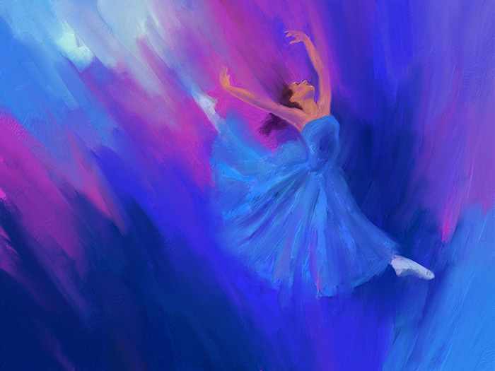
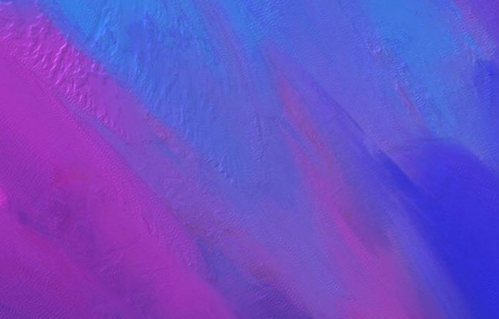
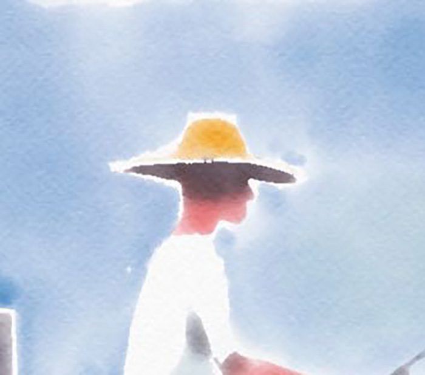
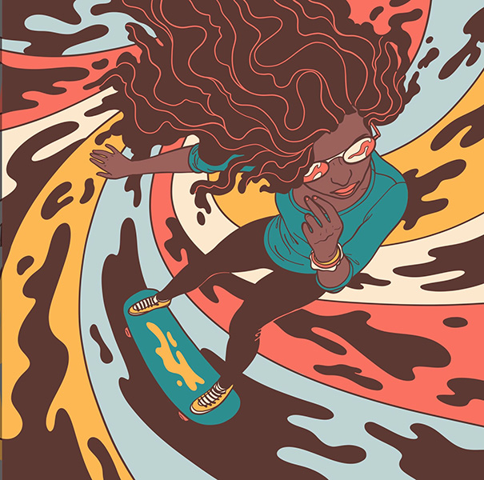

# Four Paintings that Show What You Can Do in Adobe Fresco

### Now available for iPad

Artwork created by Kyle Webster.

Four Paintings that Show What You Can Do in Adobe Fresco

A couple of years ago, I joined the Adobe team building our new [drawing and painting](https://www.adobe.com/creativecloud/drawing-painting.html) app, Adobe Fresco, to provide my perspective as a professional artist, illustrator and digital brush maker. Now, as we release Fresco to the world, I want to share an artist’s view of what you can do with the app and what I think makes it special.

Fresco is officially available for iPad today. If you have a Creative Cloud subscription, there’s a good chance you’ll be able to download it immediately. If you’re not a Creative Cloud subscriber, you can purchase it alone (with an opportunity to get the first six months free), or you can get a free version that has many of the same features as the full version, but limited access to some professional tools. You can learn more about options to get Fresco [here](https://www.adobe.com/products/fresco.html).

One of Fresco’s fundamental strengths is the variety of brushes you can use. In addition to sharp, clean, infinitely scalable vector brushes and versatile and adaptable Photoshop brushes, Fresco also includes new Live Brushes that – with the Apple Pencil – uncannily recreate the experience of painting with oils or watercolors. Let’s take a look at what you can do with each kind of brush by looking at four pieces.

## Oil brushes

I made this painting using a technique called alla prima or wet-on-wet. As that second name implies, with alla prima you apply wet paint to still-wet layers of other paint. That allows the colors to mix and blend in really interesting ways and allows one color to seamlessly flow into another.

The scientists who worked on Fresco intensely studied the way oil paints act when you apply them, how they dry, and how they interact with each other. The result is that working alla prima in Fresco is just like working alla prima with real oil paints (except that in Fresco, if you don’t like what you’ve done, you can undo it with one gesture or a simple double-tap on Apple Pencil!).

The opposite of alla prima is a technique called glazing, in which you put down a thin layer of oil paint, wait for it to dry, then put down a new thin layer. You use glazing if you don’t want the different colors of oil paint to blend, or you want to use the paint in a more transparent way. Fresco allows you to do glazing, but with some major improvements. You don’t have to wait for the first paint color to dry, you just add a new digital layer to your painting and go to work with the new color. And if you decide later you’d actually like to have the colors blend, you can merge the layers and, amazingly, the oils blend as if you’d just applied them.

I wanted this ballerina to feel like she’s a part of the environment she’s in and not separate from it and Fresco’s capabilities helped me do that. After I’d painted the background and her body, I used a brush to lightly graze some of the pink color of the background over her hand. That technique, applied to her hand, her arm, her shoe, helps make it seem like she’s jumping out of the background, instead of dancing in front of it.

The painting also shows the effects of depth and texture you can achieve with Fresco. If you brush lightly with a small amount of paint on your brush, the texture of the canvas will show through your paint, which you can see in the area of the ballerina’s hand.

If you use lots of paint, you’ll see ridges and brush marks, like those above, that give the painting a natural sense of depth and dimension.

## Watercolor brushes

Watercolors can be polarizing among artists. I love them because of the natural way paint blooms, spreading from where you apply it into neighboring parts of the paper. That can lead to beautiful effects and mixing of colors that you didn’t exactly intend, but that make a picture unique. But some artists find it very frustrating that watercolors seem to have a mind of their own.

Fresco gives you the advantages of watercolors without the frustrations. The paints still bloom and mix as they do with real-life watercolors, but if you don’t like what that natural interaction produced, you can undo it or erase part of it. Want one section to stop bleeding into another? You can dry it with a tap. You can even draw a shape, paint within it and prevent the paint from spreading beyond the boundaries of that shape.

You can see the blooming effect in the sky in this picture. After I painted the sky, I took a brush with no paint, only water, and painted areas on the right side of the painting. That pushed the pigment toward the dry part of the paper, producing that nebulous, light area of the sky that naturally blends into the darker portion.

Another watercolor technique I love is called a variegated wash, in which you blend two colors together fluidly. You see it at work in the fisherman’s head where the color of the bottom of his hat melds into the shadow on his face and then gradually becomes the pink of his skin.

If you’ve tried watercolors in the past and found them frustrating, I urge you to give them another shot in Fresco. With it, you can experiment and discover the “happy accidents” that watercolors can produce while letting you undo the unhappy accidents that would otherwise make you start over.

## Photoshop brushes

Fresco lets you use hundreds of thousands of brushes created with the Photoshop brush engine and that gives you amazing flexibility in what you create. Over the years, I’ve made thousands of Photoshop brushes – formerly available through KyleBrush.com and now available through Creative Cloud – so I know how versatile they are. Some Photoshop brushes, also known as pixel brushes, recreate simple tools like crayons or ink pens, others produce effects that would take hours to recreate by hand, like a brush that paints a string of foliage or that emulates the half-tone look of comics. Using pixel brushes, you can combine materials and techniques that wouldn’t go together with real-life materials.

One example is the dinosaur rising out of the lake. I used a brush with acrylic paint for his gleaming outer edges, but to get that mottled skin I used a combination of pink, green and purple pastels. Mixing pastels and acrylics doesn’t always work as well on actual paper, but pixels don’t care – they’ll let you use any material that brings your painting to life.

You can also use Photoshop layer blending modes in Fresco and they help you create subtle effects that are really hard to produce with natural materials. An example is this warm area of the sky. First I painted the blue sky. Then I added a layer and painted with a soft, round brush with yellow and orange together. I duplicated this warmer layer and set it to the overlay blend mode, which takes all the colors below and tints them with the colors above. I could have produced those kinds of subtle effects with natural materials, but it would have been a lot more work.

## Vector brushes

There are a couple things I love about vector brushes, like the ones I used in this illustration.

First, they’re infinitely scalable. This image is a pretty small file, but you could enlarge it to print on the side of a building and there would be no pixilation or ragged edges. It would look just as good as it does here.

Second, they’re perfectly clean. Sometimes, as with the ballerina image above, you want colors to mix and blend. And sometimes, as with this illustration, you want every color to stay in its lane. That’s easy to do with vector images. I used vector brushes to do this basic line drawing, but I didn’t even need brushes to color in much of it – I just used the paint bucket. The color I chose would magically fill in whatever shape I put it in and stop exactly at the line.

If your hand is a little unsteady or you don’t want a hand-drawn look, you can turn up the smoothing feature and your lines and curves will look more perfect and precise.

Of course, vectors are the basis of Adobe Illustrator, so you can create an image in Fresco, open it in llustrator, and do more work on it there.

As you can tell, I’m pretty excited about the release of Fresco and our team is hard at work developing even more features for future releases. We are building this app with the help and participation of the illustration community to make it the best it can be.

If you’re interested in trying Fresco for yourself, you have a great opportunity. In celebration of [The 2019 Big Draw Festival](https://www.apple.com/today/collection/the-big-draw/), you can join free art sessions at any Apple store throughout the month of October. You’ll be able to try Fresco on iPad and take part in fun drawing activities.

I know that professional artists will find a lot to love in Fresco. But I’m just as eager to have kids and people who have never thought of themselves as artists try it. Fresco on iPad lets you experiment with materials that most novices would never have access to. You can try out different kinds of media and different techniques and if things don’t turn out the way you expected, you can just undo and try something else. It’s the kind of flexible and forgiving environment that I hope will lead lots more people to discover the joys of painting and drawing.

---

by Kyle Webster  
posted on 09-24-2019

---

Topics: Art, Creativity, News

---

Products: Fresco
